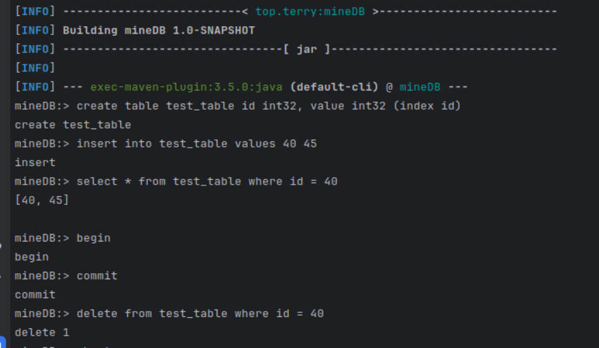

# MineDB

MineDB is a simple database implemented by Java,
some principles are referenced from MySQL,PostgreSQL and SQLLite,the project implemented:

* Data reliability and recovery 
* Two-Phase Locking (2PL) for serializable scheduling
* MVCC (Multi-Version Concurrency Control)
* Two transaction isolation levels: Read Committed and Repeatable Read
* Deadlock handling
* Basic table and column management
* A simple SQL parser
* Socket-based server and client


## how to run:

edit pom.xml first, choose the right compile version
if using IDE, change the compile version to be your JDK version

run this command to compile source code：

```shell
mvn compile
```

then execute this command to create databse in path /tmp/minedb 

```shell
mvn exec:java -Dexec.mainClass="top.terry.mineDB.backend.Launcher" -Dexec.args="-create /tmp/minedb"
```

use this command to run the default arguments for db service:

```shell
mvn exec:java -Dexec.mainClass="top.terry.mineDB.backend.Launcher" -Dexec.args="-open /tmp/minedb"
```

Now, the db service is started at 9999 local port, run the following command to connect to db:
```shell
mvn exec:java -Dexec.mainClass="top.terry.mineDB.client.Launcher"
```


you will see a special mineDB command line, input SQL phrase, enter will send the operation to service 
and output the result.

example：



